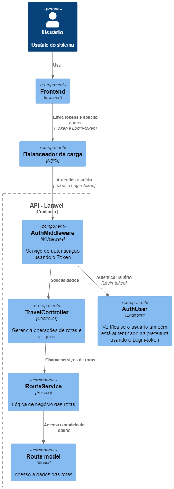

# Breve explicação

O diagrama é um espelho da funcionalidade de CRUD da funcionalidade de rotas e viagens, onde o controlador de viagens se comunica com o serviço de rotas justamente porquê possuem uma forte relação entre os modelos de viagem e rota.

O usuário solicita os dados através do frontend da aplicação, a solicitação é enviada para o balanceador de carga que redireciona para o back onde primeiro passa pelo middleware criado para verificar o usuário está autenticado e pode fazer aquela solicitação, o mesmo também verifica a autenticação no backend do sistema de login (prefeitura).

O serviço de rotas se comunica com o modelo de rota onde se comunica com o banco de dados.

